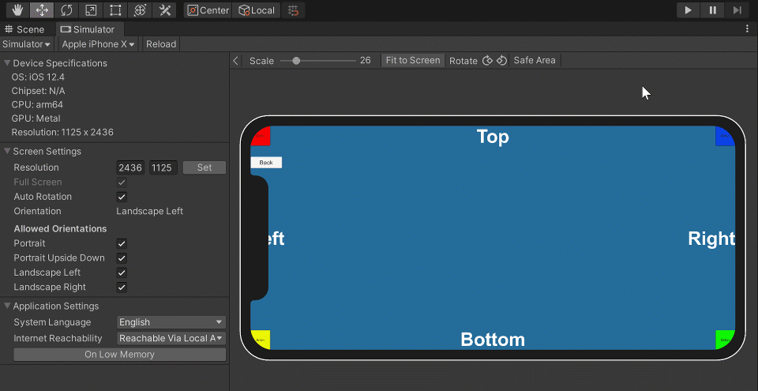

# Notch & Safe Area Sample - Device Simulator Demo
 Simple project to test cutouts, safe area APIs with [Device Simulator](https://docs.unity3d.com/Packages/com.unity.device-simulator@latest).
 The sample also illustrate how to process deep links (tested in iOS and Android, not UWP)
 
This project was used during the Unite Now session "Speeding Up Your Workflow for Mobile Apps", featuring  the new Device Simulator.
[Watch the recording (demo starts at 8;04)](https://youtu.be/7wVhQfdO-pc?t=484)

This project also demonstrate how to use Deep Linking, see related [blog post](https://blogs.unity3d.com/2020/07/16/add-deep-links-to-your-unity-mobile-apps-for-better-user-experience) and [documentation](https://docs.unity3d.com/2019.3/Documentation/Manual/enabling-deep-linking.html).

